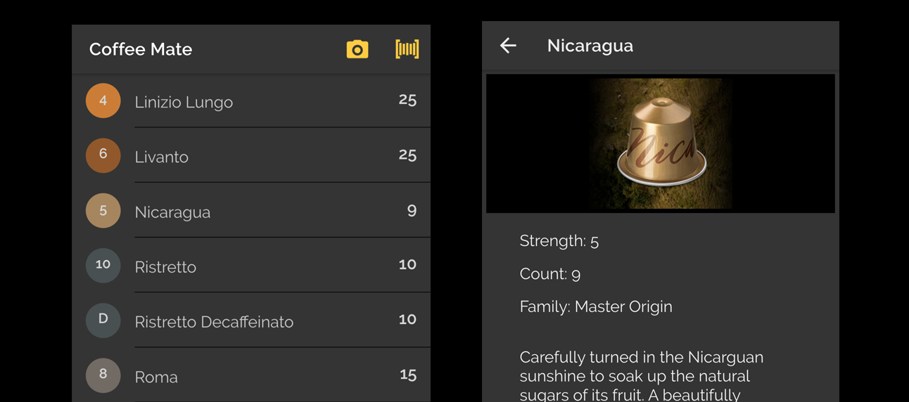
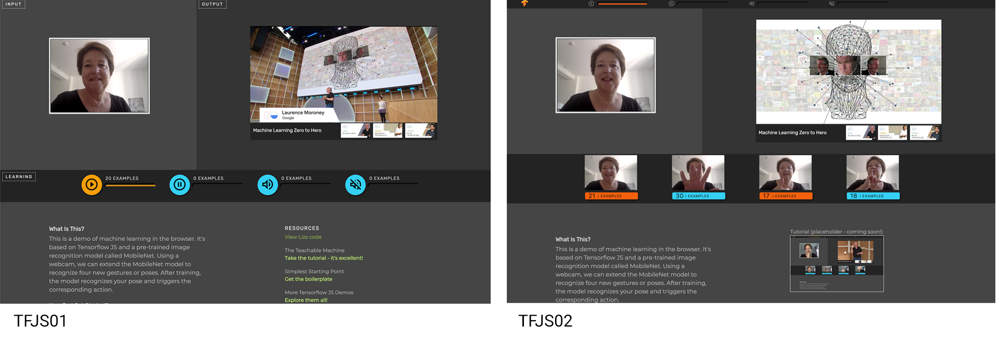
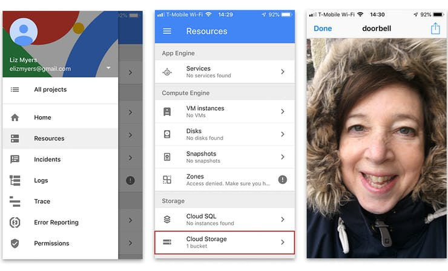

# Coffee Mate (Preview)

#### Use Case

Coffee capsules separated from boxes and info lost. What is this capsule (Visual I.D.), what flavor is it (audio I.D.), how strong is it?

#### Technologies
1. Dialogflow
2. Tensorflow
3. Firebase - database, storage, ml, cloud functions
4. Auto ML on GCP - built custom model for capsule I.D. via camera
5. Angular JS 
6. VS Code

#### Code
Coming Soon!

  

# Tensorflow

### TFJS - Experiments in Chrome

#### <a href="https://LizMyers.github.io/tfjs01/" target="_new"> TFJS01 </a>

This project use the MobileNet Model for image recognition and the YouTube API for video control. In this example, the user trains the model on four gestures or poses that correspond to four video actions: play, pause, unmute, mute. While the program runs, the webcam is watching for one of the poses and responds with the corresponding action. Please note: this project is designed for Chrome on desktop/laptop. It's best viewed in full screen mode.

#### <a href="https://LizMyers.github.io/tfjs02/" target="_blank">TFJS02</a>

<b>The first version used standard video control buttons for training.</b> In a quick usability test, I discovered the UI caused friction because the mental model is broken. Although the buttons look like real playback controls, they don't function as such during inference. Once Tensorflow kicks in... the only way to control playback is with one of the custom gestures. 

<b>Here's what I did to improve usability:</b>
1. Separated training and inference areas (bottom and top rows respectively)
2. Implemented icons as labels rather than buttons (greyed out, single state)
3. Added still images on capture - reminding users of gestures and related actions

Please note: this project is designed for Chrome on desktop/laptop. It's best viewed in full screen mode.

  

# AIY Voice Kit 

#### Smart Doorbell?
Imagine, when someone rings your bell, it prompts the Google Assistant to greet the visitor. The Pi camera takes their picture and saves it up to the cloud for review. Once you've had a chance to confirm the visitors identity visually, you can ask the Assistant to open the door and let them in. A detailed tutorial is available <a href="https://www.hackster.io/elizmyers/aiy-smart-doorbell-02d8ad" target="_blank">here</a>.

#### What is That?
This project adds computer vision to the voice kit, so that machines can describe what they see! Using a Raspberry Pi, Tensorflow, and Python, you can identify three classes: logos, text, and objects. A detailed tutorial is available <a href="https://www.hackster.io/elizmyers/add-vision-to-the-aiy-voice-kit-e9ff3d" target="_blank">here</a>.
